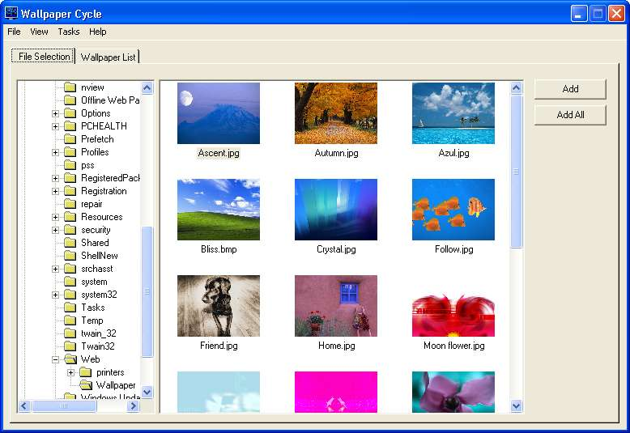



## Wallpaper Cycle 1\.3

### Description

Changes your wallpaper automatically at intervals such as minutes, hours, days, weeks. Displays all images in directories as plain icons or thumbnails. This version has been completeted but no fully tested so bugs can be expected.

Here is a list of the features added from version 1.1

1. Now fully tested and working on 98/ME/XP Should work on NT and 2000 but I haven't tested it on those operating systems.

2. Items in the listview can be sorted.

3. The tray icon can be hidden if desired.

4. image files from explorer can be dragged and dropped into the wallpaper list.

5. The wallpaper can be changed at minute intervals.

6. the controls don't move into the wrong position when the form is resized.

7. The windowpane between the directory listbox and file list box can be resized.

8. the wallpaper can be changed at a daily/weekly interval at specific times (example, every 4 days at 3:00PM)

Please report any bugs to adz8@softhome.net I cannot find all the bugs myself and I would like to eliminate as many as possible before I submit the new verison on Download.com
 
### More Info
 

             |
---                |---
**Submitted On**   |2002-10-11 00:09:40
**By**             |[Adam\. A\. Black](https://github.com/Planet-Source-Code/PSCIndex/blob/master/ByAuthor/adam-a-black.md)
**Level**          |Intermediate
**User Rating**    |5.0 (15 globes from 3 users)
**Compatibility**  |VB 6\.0
**Category**       |[Complete Applications](https://github.com/Planet-Source-Code/PSCIndex/blob/master/ByCategory/complete-applications__1-27.md)
**World**          |[Visual Basic](https://github.com/Planet-Source-Code/PSCIndex/blob/master/ByWorld/visual-basic.md)
**Archive File**   |[Wallpaper\_14435910112002\.zip](https://github.com/Planet-Source-Code/adam-a-black-wallpaper-cycle-1-3__1-39722/archive/master.zip)

